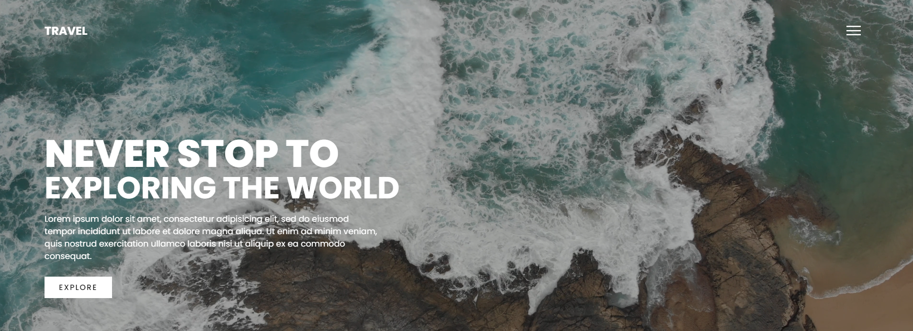

# Landing-Travel⭐⭐⭐⭐☆


<p align="center" style="color: white;">
    
</p>


<p>
    <a href="https://www.linkedin.com/in/juan-estaban-ar%C3%A9valo-056bab240/" target="_blank" rel="Linkedin">
      
    </a> 
    <a href="https://www.instagram.com/jeacsi.official_022?igsh=MWJ6MHRwcnhoZXVxbQ==" target="_blank" rel="Instagram">
      
    </a>
</p>
<p>Se ha creado una landing page de "Travel" que presenta un atractivo fondo de video con un mar en movimiento y una barra lateral interactiva. Esta página ofrece una experiencia visual impresionante y dinámica, ideal para captar la atención de los usuarios desde el primer momento.</p>

<p>Visualizar trabajo en 
    <a href="https://codepen.io/Juan-Esteban-Ar-valo/pen/rNgMrOP" target="_blank">
        
    </a>
</p>


```bash
    git clone https://github.com/Juanes200122/Skills_Sections.git
    cd Skills_Sections
```
<div align="right">
    


</div>

## <b> Funcionalidad del traslado showcase</b>


```JS
const menuToggle = document.querySelector('.toggle');
const showcase = document.querySelector('.showcase');

menuToggle.addEventListener('click', () => {
  menuToggle.classList.toggle('active');
  showcase.classList.toggle('active');
})
```

</br>

## <b> Skills</b>
  - 💻 &nbsp;
    
  - 🌐 &nbsp;
    
    
